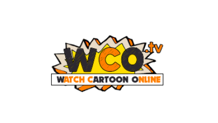

# WCO Wrapper
An unofficial app for the Watch Cartoon Online streaming network that is essentially an elaborately wrapped HTML scraper. The aim of this app is to improve the user experience of the site on mobile by implementing series progress trackers and the ability to save a series to watch later.

## App Features
* Keep track of the shows that you want to watch by adding them to your Watchlist, the shows that you add will then be accessible directly from the home screen.
* Track your progress while watching the shows you love and easily traverse to the next episode from the home screen or the episode list.
* Be notified when new episodes are released for any of the shows on your Watchlist, in order to clear the entry from the home screen you simply have to go to the episode list for that series.
* Easily find the show you're looking for with the integrated search feature.
* Browse from a variety of genres.
  * [Note that this feature is experimental and must be enabled in settings].
* Seamlessly switch between WCO domains in the event that one is down or not working for you.
  * [Once again this can be done in settings].
* Submit bug/issue reports or ideas for future improvements to the app via the option in settings.

## Installation
In order to install the app simply download the latest APK from the releases tab and run it on your device. If you run into any issues due to security policies on the device ensure that you have `install from unknown sources` enabled somewhere in your devices settings.

If you have issues within the browser such as forced redirects, it is recommended to either switch preferred domains in settings or use a VPN to circumvent the redirect.

## Credit
* [Moshi](https://github.com/square/moshi): Storage and retrieval of critical app data formatted as JSONs
* [Picasso](https://github.com/square/picasso): Displaying image content from URLs
* [JSoup](https://jsoup.org/): HTML scraping operations
* [Google Material Symbols](https://fonts.google.com/icons): Open source icons used throughout the app
* [Watch Cartoon Online](https://www.wcofun.com/): Site that the app is designed to function as an unofficial mobile wrapper for

## Disclaimers
This App is not officially affiliated with the WCO brand of streaming sites but rather it is simply a fan project to improve the user experience of the sites and attempt to better adapt them for mobile devices. With this in mind, please do not direct issues regarding the app towards the site admins but instead to the issues page on this repository.
### Legal Disclaimer
Neither the WCO Wrapper nor its authors are not responsible for any infringing content linked to or referred to by the app. WCO Wrapper has no control over what is linked to by the WCO sites and the app iteself does not host any infringing content.
